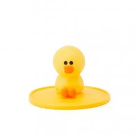

You’ll find this post in your `_posts` directory. Go ahead and edit it and re-build the site to see your changes.

Jekyll also offers powerful support for code snippets:

​```python
def print_hi(name):
  print("hello", name)
print_hi('Tom')
​```

<h3>  연습용입니다. </h3>

 - **이미지가 올라갈까? 한글은?**
      
<br>